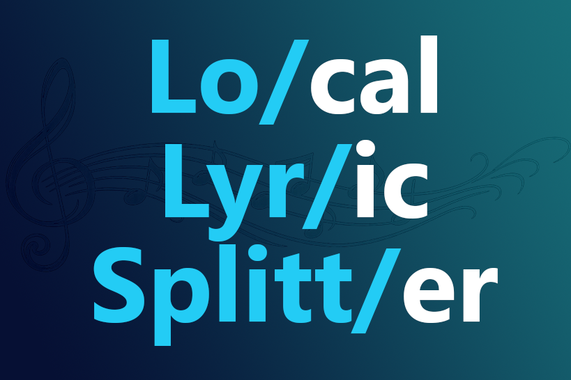
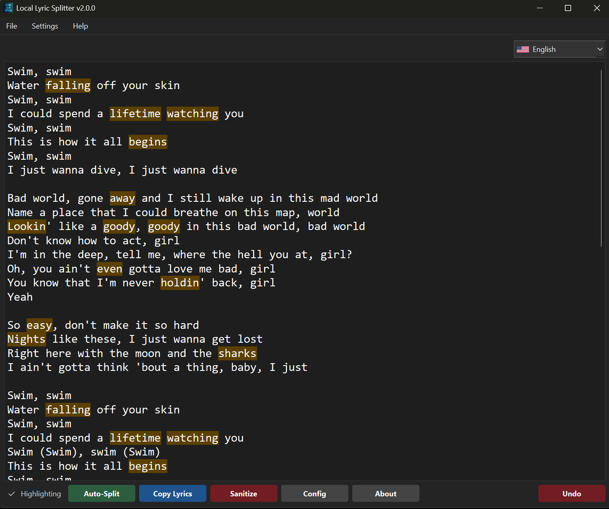

<h1 align="center">🎤 Local Lyric Splitter</h1>

    <b>Local Lyric Splitter</b> is a high-speed text processing tool designed for karaoke creators. 
    It automates the tedious process of syllable splitting while learning your specific editing style in real-time.

  

__________________________________________________________________________________________

### 📸 Main App Screenshot

__________________________________________________________________________________________

### ✨ Key Features

* ⚡ **Live-Sync Word Correction:** Type a `/` or `_` once, and the app instantly updates every other identical word in your project. No more manual Find & Replace for repetitive lyrics.
* 🧠 **Smart Highlighting:** The app automatically highlights words that likely need splitting (≥5 letters) or known "Trip-Up" words, ensuring you never miss a syllable.
* 🛠 **Dynamic Learning:** Right-click any word to instantly add it to your "Ignore" list or "Trip-Up" database. The app gets smarter the more you use it.
* 🧹 **Sanitizer Logic Summary:**
  - **Ad and Tag Removal:** Specific repetitive phrases like "See...Live" (9 lines) and "You might also like" (7 lines) patterns from Genius are removed entirely when you click `Sanitize`. `[Verse]`, `[Chorus]`, etc. are also removed.
  - **Spacing Protection:** `Sanitize` leaves exactly one blank line between stanzas, even if the source text had messy double-spacing or no spacing at all (if there were `[Tags]`).
  - **History Preservation:** The `Undo` button acts as a safety net if a "Sanitize" goes wrong.
* 📂 **Load and Save .txt files:** You can save your work or load up a lyrics `.txt` file from the file menu. You can also drag and drop anywhere in the app.
* 📂 **Organized JSON Database:** Your custom split rules are saved to a `config.json` that is automatically alphabetized and cleaned every time the app starts. The program comes with some default words in the database, as well.
* 📂 **JSON Database Sharing:** You can export or merge the `.json` file to share or combine dictionaries with anyone. It doesn't overwrite your original dictionary. NOTE: You can always download the latest `.json` from the repository which will be a combination of mine and Rose's dictionary, but it will be packaged in every subsequent version to the date posted. Feel free to update the app and merge with the root `config.json` file.
* ↩️ **Safety Undo:** A dedicated Undo button allows you to step back through your changes, making experimentation with the Auto-Splitter risk-free. You can also fix a mistake like if you write hel/lo and want hell/o, just change it once and it will globally change, as well. Ctrl+Z works, too!
* 🤖 **Dictionary-Based Auto-Split:** One-click processing uses the Pyphen engine to provide a baseline split for the entire text.

__________________________________________________________________________________________

### 🎯 How It Works

1. **Paste** your raw lyrics into the editor.
2. **Auto-Split** to get a 70% head start using the built-in dictionary.
3. **Manual Refine:** Address the "Glowing" words. As you fix one, the app fixes the rest.
4. **Train the App:** Right-click words that don't need splitting to "Ignore" them permanently.

__________________________________________________________________________________________

### ⚠️ Known Limitations & Best Practices

To maintain the speed and stability of the word-syncing engine, please keep the following in mind:

* **Syllable Consistency:** The "Live-Sync" logic works by matching the base word. If you change the *number* of syllables for the same word in different places, you should write them out phonetically or as extended syllables for the sync to remain accurate.
    * *Example:* If you have **"Hello"** (2 syllables) and **"Hello-o-o"** (4 syllables), write them differently so the app doesn't try to force the 2-syllable split onto the 4-syllable version.
* **Non-Alphanumeric Characters:** Symbols attached directly to words (like parentheses or complex punctuation) may occasionally interfere with the "Whole Word" highlighting logic.

__________________________________________________________________________________________

### 🧊 Advanced Configuration
The `config.json` is the heart of the app. You can edit it directly via the **Config** button in the UI:
* **Trip-Up Words:** Words that the dictionary always misses (e.g., `into: in/to`).
* **False Positives:** Long words that should never be highlighted (e.g., `through`).

__________________________________________________________________________________________

### 🛠 Technology
* **Python**
* **PySide6** (Professional Qt-based Dark UI)
* **Pyphen** (Syllable Hyphenation)
* **PyInstaller** (One-dir distribution)

__________________________________________________________________________________________

### 📜 Licensing
Local Lyric Splitter is proprietary software.
© 2026 Matt Joy. All rights reserved.

YouTube: [youtube.com/@MattJoyKaraoke](https://www.youtube.com/@MattJoyKaraoke)
GitHub: [github.com/mattjoykaraoke](https://github.com/mattjoykaraoke)

__________________________________________________________________________________________

### 🍺 Acknowledgements
Thank you to the creators at the [diveBar discord](https://discord.gg/diveBar). I'm proud to be one of you.

Special thanks to:

[incidentist](https://github.com/incidentist) for his project, [The Tüül](https://the-tuul.com/), which inspired this project.

[Rose's Garden Variety Karaoke](https://www.youtube.com/@Roses-karaoke) for her stress testing and excellent suggestions which help make the application helpful for everyone. She also provided her personal `.json` dictionary for the good of the community.
